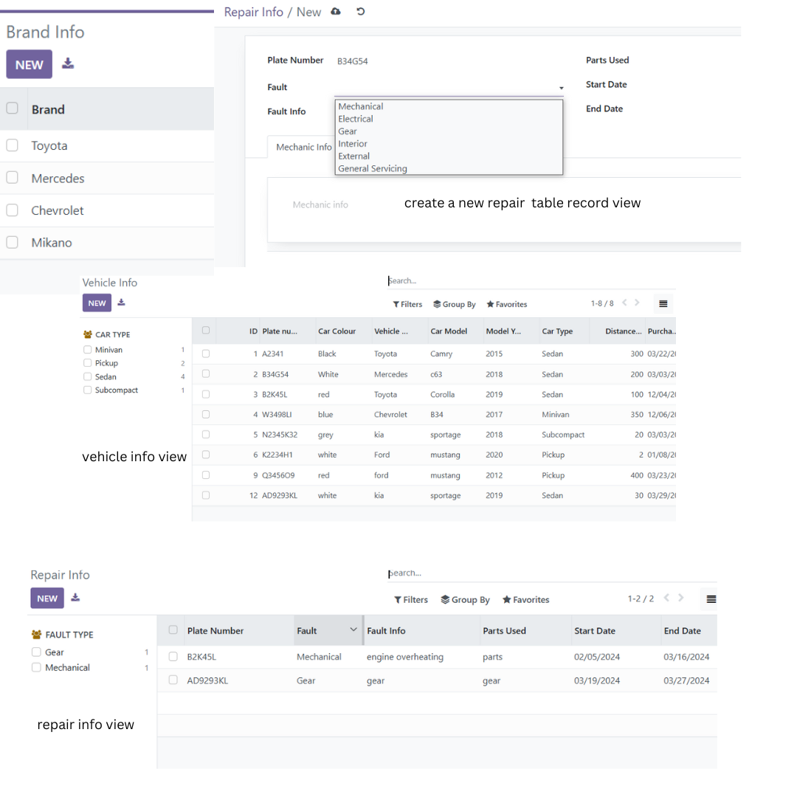
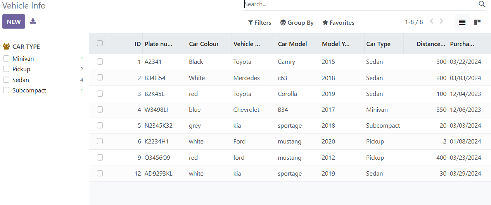
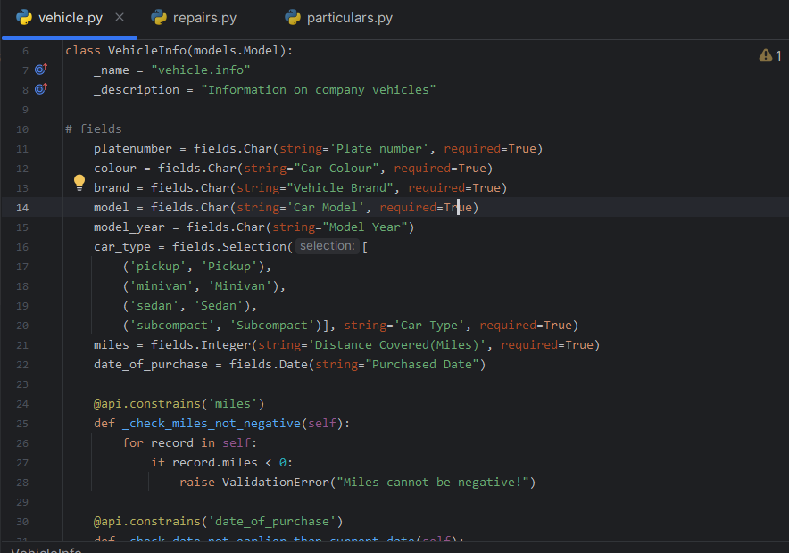
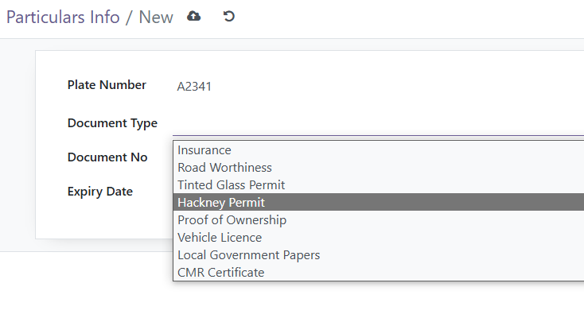
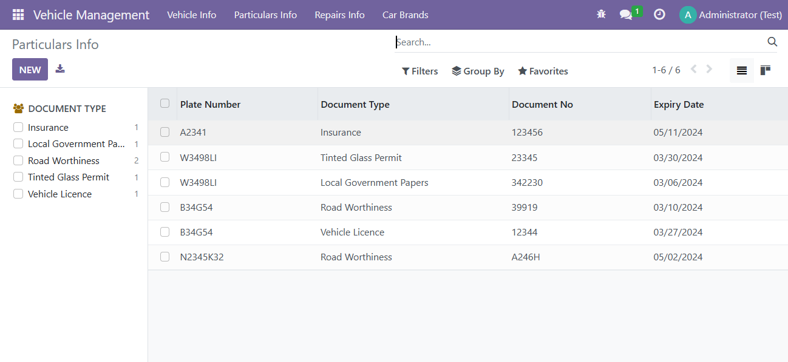
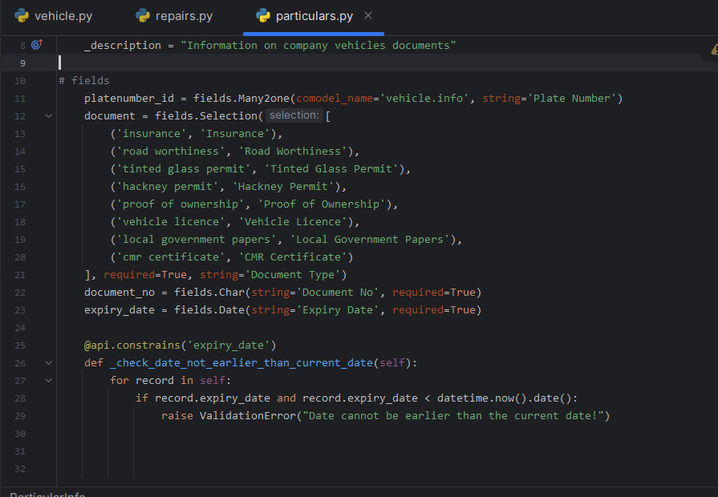
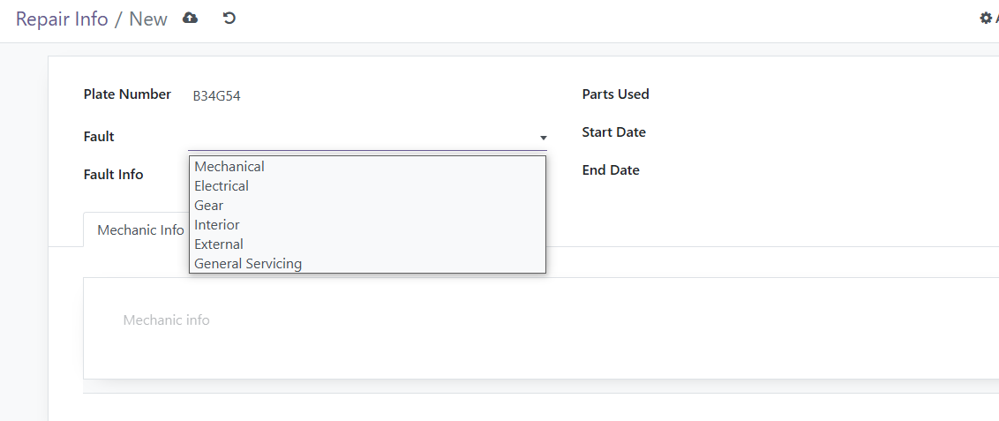
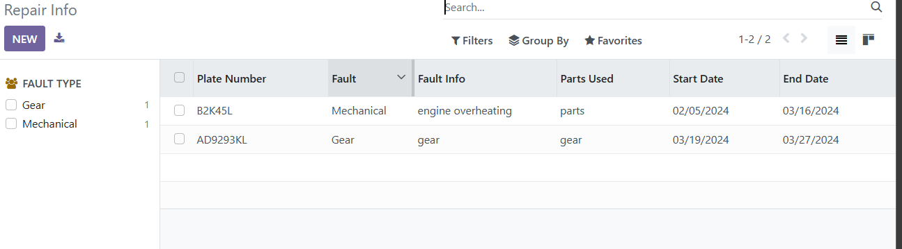
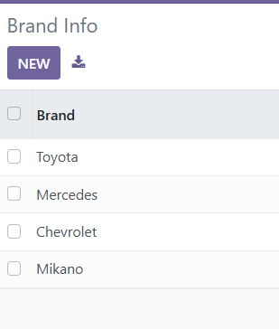
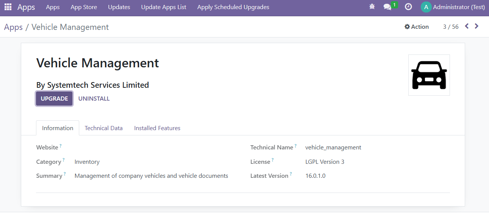

# Vehicle Management

Vehicle Management is a custom Odoo add-on for recording company vehicles, tracking vehicle documents and their expiry dates, and maintaining repair history.

The module is maintained by **Systemtech Services Limited** and is distributed under the **LGPL-3** license.

<p align="center">
  
</p>

## Features

### Vehicle registry

- Record vehicle plate number, colour, brand, and model.
- Record model year, vehicle type, purchase date, and mileage.
- Search and filter vehicles by their recorded details.
- Group and filter vehicles by type.

#### Vehicle list

<p align="center">
  
</p>

#### Vehicle model

<p align="center">
  
</p>

Supported vehicle types are:

- Pickup
- Minivan
- Sedan
- Subcompact

### Vehicle particulars

- Link documents to vehicles by plate number.
- Record document numbers and expiry dates.
- Filter documents by type.
- Find documents that expire within the next two months.

#### Document form

<p align="center">
  
</p>

#### Document list

<p align="center">
  
</p>

#### Document model

<p align="center">
  
</p>

Supported document types include:

- Insurance
- Road Worthiness
- Tinted Glass Permit
- Hackney Permit
- Proof of Ownership
- Vehicle Licence
- Local Government Papers
- CMR Certificate

### Repair records

- Link repairs to vehicles by plate number.
- Record fault type, fault details, parts used, and repair dates.
- Store mechanic information and costs incurred.
- Search, filter, and group repairs by fault type.

#### Repair form

<p align="center">
  
</p>

#### Repair list

<p align="center">
  
</p>

Supported fault types include mechanical, electrical, gear, interior, external, and general servicing.

### Vehicle brands

- Maintain a searchable list of vehicle brand names.

<p align="center">
  
</p>

> **Note:** The current vehicle form stores its brand as free text. The separate brand catalog is not yet linked to the vehicle record.

## Requirements

- An Odoo installation compatible with this module's Python and XML view syntax
- The Odoo `base` module
- Access to the Odoo add-ons directory and configuration

The target Odoo major version is not currently declared. Confirm compatibility with your Odoo environment before deploying to production.

## Installation

1. Copy or clone this repository into one of the directories configured in Odoo's `addons_path`.
2. Restart the Odoo server.
3. Enable developer mode in Odoo.
4. Open **Apps** and select **Update Apps List**.
5. Search for **Vehicle Management**.
6. Select **Install**.

<p align="center">
  
</p>

For command-line installations, update the database with the module name used by its directory:

```bash
odoo-bin -d <database_name> -i vehicle_management
```

To upgrade an existing installation after changing the module:

```bash
odoo-bin -d <database_name> -u vehicle_management
```

Adjust the executable, configuration arguments, and database name to match your Odoo environment.

## Usage

After installation, open **Vehicle Management** from the Odoo application menu.

1. Add company vehicles under **Vehicle Info**.
2. Add their legal and operational documents under **Particulars Info**.
3. Record maintenance and repairs under **Repairs Info**.
4. Maintain the optional brand catalog under **Car Brands**.

Vehicle documents and repairs are linked to records created under **Vehicle Info**.

## Access control

All internal Odoo users in the standard `base.group_user` group currently have read, create, update, and delete access to vehicles, particulars, repairs, and brands.

The module does not currently define manager roles, record rules, or company-specific restrictions. Review the access configuration before using it in an environment with sensitive fleet data or multiple companies.

## Project structure

```text
vehicle_management/
|-- models/
|   |-- vehicle.py
|   |-- particulars.py
|   |-- repairs.py
|   `-- brands.py
|-- security/
|   `-- ir.model.access.csv
|-- static/
|   `-- description/
|       `-- icon.png
|-- views/
|   |-- menu.xml
|   |-- vehicle_view.xml
|   |-- particulars_view.xml
|   |-- repairs_view.xml
|   `-- brands_view.xml
|-- __init__.py
`-- __manifest__.py
```

## Data model overview

```text
vehicle.info
  |-- particular.info (many records can reference one vehicle)
  `-- repairs.info    (many records can reference one vehicle)

vehicle.brand        (currently maintained independently)
```

## Current limitations

- The vehicle brand catalog is not connected to the brand field on vehicle records.
- There are no automated tests or demo records.
- Plate numbers, document numbers, and brand names do not have uniqueness constraints.
- Document-expiry tracking is available through a search filter, but there are no automatic reminders or scheduled notifications.
- Repair costs are stored as formatted text rather than as monetary values, so they cannot be reliably aggregated.
- Vehicle records do not display their documents or repair history directly on the vehicle form.
- The module does not provide multi-company record rules.

## Development

When changing models, security rules, or views, restart Odoo and upgrade the module:

```bash
odoo-bin -d <database_name> -u vehicle_management
```

Test changes in a development database before upgrading a production installation.

## License

This project is licensed under the [GNU Lesser General Public License v3.0](https://www.gnu.org/licenses/lgpl-3.0.html).

## Author

**Systemtech Services Limited**
